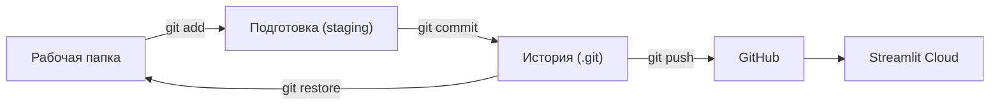

# Калькулятор закята

Учебный проект: веб-калькулятор годового закята на Python и Streamlit. Одновременно это пример полного пути от пустой папки до сайта в интернете: git, GitHub, деплой и проверка кода, который написал ИИ.

Сайт: https://zakatcalctest.streamlit.app/

> Методика здесь упрощённая и учебная. Окончательные правила расчёта утверждает специалист по исламским финансам.

## Что считает калькулятор

Пользователь выбирает, по какому металлу считается нисаб (золото 85 г или серебро 595 г) и ставку (2,5% за лунный год или 2,577% за солнечный). Затем вводит цену грамма металлов, свои активы и долги. Калькулятор складывает активы, вычитает долги и сравнивает чистые активы с нисабом. Если нисаб достигнут, показывает сумму закята, если нет — сколько до нисаба не хватает.

### Контрольные примеры

Нисаб по золоту, ставка 2,5%, условная цена золота 50 000 ₸ за грамм, значит нисаб = 85 × 50 000 = 4 250 000 ₸.

| Ввод | Ожидаемый результат | Что проверяет |
|---|---|---|
| Наличные 4 000 000 | Закят 0, «не хватает 250 000 ₸» | Сумма ниже нисаба |
| Наличные 5 000 000 | Закят 125 000 ₸ | Обычный случай |
| Наличные 4 250 000 | Закят 106 250 ₸ | Граница: ровно нисаб тоже облагается (`>=`) |
| Наличные 5 000 000, долги 1 000 000 | Закят 0 | Долги вычитаются из активов |

Ответы посчитаны руками до того, как был написан код. Любая правка проверяется на этих примерах до коммита.

## Структура проекта

| Файл | Зачем нужен |
|---|---|
| `app.py` | Код калькулятора: функция `calculate_zakat` (методика) и интерфейс |
| `requirements.txt` | Список библиотек; по нему сервер собирает окружение |
| `.gitignore` | Что не попадает в git: `.venv`, `.env`, `__pycache__` |
| `README.md` | Этот файл |

## Как запустить у себя

```bash
git clone https://github.com/AdiletKarim/zakat-calc.git
cd zakat-calc
python3 -m venv .venv
source .venv/bin/activate
pip install -r requirements.txt
streamlit run app.py
```

Откроется `http://localhost:8501`. Остановить сервер: `Ctrl+C`.

`.venv` — отдельная копия Python с библиотеками этого проекта. Команда `source .venv/bin/activate` включает её в текущей вкладке терминала, а приставка `(.venv)` в начале строки показывает, что окружение активно. В каждой новой вкладке активировать нужно заново, иначе терминал ответит `command not found: streamlit`.

## Как устроен git: четыре места



Git — фотоаппарат для папки проекта. Коммит — снимок всех файлов с автором, временем, подписью и ссылкой на предыдущий снимок. Хеш вроде `9668349` — отпечаток снимка, вычисленный из его содержимого. Вся история хранится в скрытой папке `.git`.

**Рабочая папка** — обычные файлы, которые правишь ты или ИИ.

**Подготовка** — список того, что войдёт в следующий снимок. Позволяет выбрать: `git add app.py` положит только один файл. В `git status` это видно как разница между `Changes not staged for commit` (изменено, но не подготовлено) и `Changes to be committed` (подготовлено).

**История** — все снимки. `git commit` превращает подготовку в новый снимок.

**GitHub** — копия истории в интернете. `git push` отправляет туда новые снимки.

**Streamlit Cloud** скачивает код с GitHub, ставит библиотеки по `requirements.txt`, запускает `app.py` и даёт публичный адрес. При каждом новом коммите в `main` он обновляет сайт сам.

Главное правило: каждое место обновляется только своей командой. Правка файла не меняет историю, коммит не меняет GitHub, и только после `push` обновляется сайт.

### Ярлыки в `git log`

| Ярлык | Что означает |
|---|---|
| `main` | Последний снимок ветки; при каждом коммите переезжает вперёд |
| `HEAD` | Где ты сейчас, обычно там же, где `main` |
| `origin` | Короткое имя адреса репозитория на GitHub |
| `origin/main` | Что компьютер последний раз знал о `main` на GitHub |

Запись `HEAD -> main, origin/main` на одном коммите означает, что у тебя и на GitHub одна и та же версия.

## Рабочий цикл

1. Внести правку (самому или через ИИ).
2. `git status` — какие файлы изменились, не попало ли лишнее.
3. `git diff` — какие именно строки изменились.
4. Проверить на контрольных примерах.
5. `git add .` — подготовить изменения.
6. `git commit -m "что сделал"` — сделать снимок.
7. `git push` — отправить на GitHub; через 1–2 минуты сайт обновится сам.

## Как проверять код, написанный ИИ

ИИ можно доверять ровно настолько, насколько его работу удаётся быстро проверить. Протокол:

1. Посчитать ожидаемые ответы руками до того, как появился код.
2. Убедиться, что старт чистый: `git status` показывает `working tree clean`.
3. Поставить задачу узко и добавить «больше ничего не меняй».
4. До того как смотреть код, спросить ИИ: «Перечисли точно, какие строки ты изменил».
5. Заменить файл: скопировать код и выполнить `pbpaste > app.py`.
6. Сравнить слова ИИ с фактом: `git diff --stat` и `git diff`.
7. Прогнать контрольные примеры, особенно граничный.
8. Если всё сходится, коммит. Если нет, `git restore app.py` и переформулировать задачу.

### Реальный случай из этого проекта

Задача: показывать, сколько не хватает до нисаба. ИИ заявил, что изменил 3 строки: 2 добавил и 1 удалил. `git diff --stat` показал 5: 3 добавлено и 2 удалено. Лишней оказалась последняя строка файла. При копировании через `pbpaste` потерялся невидимый перевод строки, и git отметил это как `\ No newline at end of file`. Основная правка была честной, но файл изменился ещё в одном месте, и узнали мы это только из diff. Исправление: `echo >> app.py`, после чего diff совпал с заявлением.

Вывод: ИИ описывает свои изменения в пересказе, а diff показывает факт. Невидимые и «попутные» изменения ловит только diff.

## История проекта

1. **Настройка git.** Выполнены `git config --global user.name`, `user.email` и `init.defaultBranch main`. Почта в git должна совпадать с почтой в аккаунте GitHub, иначе коммиты не привязываются к профилю и показываются с серой заглушкой вместо аватарки.
2. **Репетиция на тестовом репозитории.** Пройдены команды коммита, отправки на GitHub, просмотра изменений и отката.
3. **Создание проекта.** Папка, окружение `.venv`, установка Streamlit, первый запуск на `localhost`.
4. **Первый коммит и GitHub** (`9668349`). Перед коммитом `git status` проверил, что в список попали только три нужных файла, а `.venv` отсечён `.gitignore`.
5. **Деплой на Streamlit Community Cloud.** Две ошибки по дороге: Streamlit не видел репозиторий, потому что сервер был запущен до `git init`, и бесплатный тариф допускает только одно приложение из приватного репозитория. Репозиторий сделан публичным, так как секретов в нём нет.
6. **Проверка автообновления** (`7425947`). Правка подписи → коммит → push → сайт обновился сам.
7. **Проверка ИИ на реальной задаче** (`cfdc1c5`). Описана выше.

## Ловушки и решения

| Симптом | Причина | Решение |
|---|---|---|
| 404 на своём репозитории | Репозиторий приватный, браузер не залогинен | Войти в GitHub в браузере |
| Серая аватарка у коммитов | Почта в git не та, что в GitHub | `git config --global user.email "почта_из_github"` |
| Команды в терминале не выполняются | Вкладка занята работающим сервером | Открыть новую вкладку: `Cmd+T` |
| `command not found: streamlit` | Не активирован `.venv` | `source .venv/bin/activate` |
| Streamlit: «not connected to a remote GitHub repository» | Сервер запущен до `git init` | Перезапустить `streamlit run app.py` |
| «One private app per workspace» | Лимит бесплатного Streamlit | Сделать репозиторий публичным, если в нём нет секретов |
| `nothing to commit, working tree clean` | Файл не менялся | Сначала правка, потом коммит |
| `\ No newline at end of file` | При копировании потерялся последний перевод строки | `echo >> имя_файла` |
| Застрял в редакторе vim | Git открыл редактор для подписи коммита | `Esc`, затем `:wq` и Enter; в следующий раз добавлять `--no-edit` |

## Шпаргалка команд

| Команда | Что делает |
|---|---|
| `git status` | Что изменено и что подготовлено |
| `git diff` | Построчная разница между папкой и последним снимком |
| `git diff --staged` | То же для уже подготовленных изменений |
| `git diff --stat` | Объём изменений: сколько строк добавлено и удалено |
| `git add .` | Подготовить все изменения |
| `git commit -m "..."` | Сделать снимок |
| `git push` | Отправить снимки на GitHub |
| `git log --oneline` | Короткая история снимков |
| `git show <хеш>` | Что изменилось в конкретном снимке |
| `git restore .` | Выбросить все незакоммиченные изменения (без возврата) |
| `git revert HEAD --no-edit` | Отменить последний коммит новым коммитом |
| `pbcopy < файл` / `pbpaste > файл` | Скопировать файл в буфер / записать буфер в файл (macOS) |

## Безопасность

Репозиторий публичный: код и вся история видны всем. В нём не должно быть ключей, паролей, личных и финансовых данных. Ключи хранятся в файле `.env`, который указан в `.gitignore` и никогда не попадает на GitHub. Перед каждым коммитом смотреть `git status`. Для проектов с семейными, медицинскими или финансовыми данными бесплатный Streamlit не подходит: нужен собственный сервер.

## Проверь себя

<details>
<summary>1. Изменил файл, сделал коммит, а сайт не обновился. Почему?</summary>

Не было `git push`. GitHub, а значит и Streamlit, о новом снимке не знает.
</details>

<details>
<summary>2. Изменил файл и сразу сделал commit без add. Что скажет git?</summary>

`no changes added to commit`: подготовка пуста, снимать нечего.
</details>

<details>
<summary>3. ИИ сломал код, и ты уже закоммитил. Поможет git restore?</summary>

Нет. `restore` возвращает к последнему снимку, а он уже сломан. Нужен `git revert HEAD --no-edit`.
</details>

<details>
<summary>4. Почему в новой вкладке терминала streamlit не находится?</summary>

Не активирован `.venv`: `source .venv/bin/activate`.
</details>

<details>
<summary>5. Папка проекта удалена целиком. Всё пропало?</summary>

На компьютере да, но на GitHub всё есть: `git clone https://github.com/AdiletKarim/zakat-calc.git` вернёт проект со всей историей.
</details>
